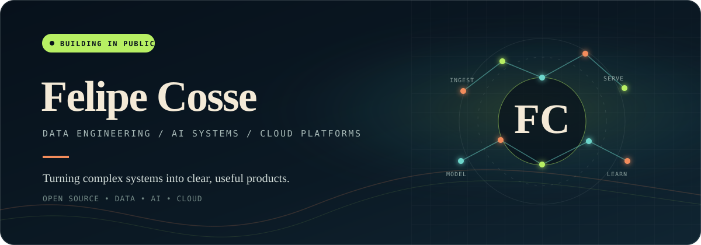

  

  I build at the intersection of <strong>data engineering</strong>, <strong>applied AI</strong>, and <strong>cloud platforms</strong>.
   
  My favorite work turns raw signals into reliable systems—and reliable systems into useful products.

  <a href="#selected-builds">Selected builds</a>
  &nbsp;·&nbsp;
  <a href="#toolkit">Toolkit</a>
  &nbsp;·&nbsp;
  <a href="https://github.com/felipe-cosse?tab=repositories">All repositories</a>

 

## What I care about

| | Focus | What good looks like |
|:--|:--|:--|
| **01** | Data foundations | Pipelines that are observable, testable, and easy to trust |
| **02** | Applied AI | Agents and models grounded in real workflows—not demos |
| **03** | Cloud delivery | Systems that stay understandable after they reach production |

## Selected builds

<table>
  <tr>
    <td width="50%" valign="top">
      <h3><a href="https://github.com/felipe-cosse/arrived-investment-agent">Arrived Investment Agent</a></h3>
      
An AI-assisted experiment for investment research and decision support.

      <code>agents</code> <code>analysis</code> <code>AI</code>
    </td>
    <td width="50%" valign="top">
      <h3><a href="https://github.com/felipe-cosse/global_flight_tracker">Global Flight Tracker</a></h3>
      
Exploring global flight data through a focused tracking project.

      <code>data</code> <code>tracking</code> <code>visualization</code>
    </td>
  </tr>
  <tr>
    <td width="50%" valign="top">
      <h3><a href="https://github.com/felipe-cosse/5-Day-AI-Agents-Intensive-Course-with-Google">AI Agents Intensive</a></h3>
      
Hands-on notebooks and exercises for building modern agent systems.

      <code>agents</code> <code>notebooks</code> <code>learning</code>
    </td>
    <td width="50%" valign="top">
      <h3><a href="https://github.com/felipe-cosse/udacity-generative-ai">Generative AI</a></h3>
      
Practical work across contemporary generative-AI concepts and workflows.

      <code>GenAI</code> <code>LLMs</code> <code>coursework</code>
    </td>
  </tr>
</table>

## Toolkit

`Python` · `SQL` · `Apache Spark` · `dbt` · `Snowflake` · `AWS` · `Docker` · `Terraform` · `AI Agents`

---

  Always learning. Usually building. Occasionally turning a notebook into infrastructure.
    
  <a href="https://github.com/felipe-cosse">Follow the work →</a>

